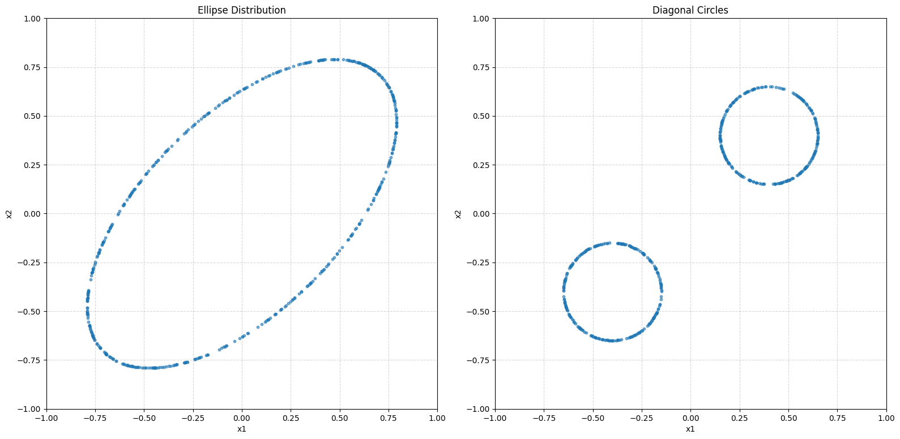
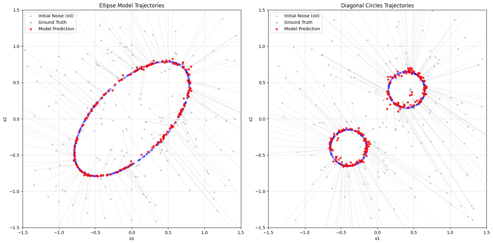
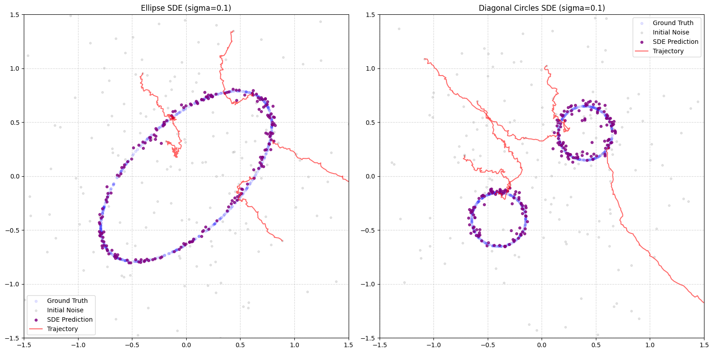



> The code below is trimmed to the essentials; the full, runnable version lives in the original notebook:
> [**github.com/litlig/notebooks/2d_diffusion.ipynb**](https://github.com/litlig/notebooks/blob/main/2d_diffusion.ipynb)
>
> <a href="https://colab.research.google.com/github/litlig/notebooks/blob/main/2d_diffusion.ipynb" target="_parent"></a>

## Problem framing

All images are sampled from a probability distribution in a high-dimensional space. To generate an image, we can directly model that distribution. Diffusion models follow a different path: they model the trajectory of transforming a sample generated from a known distribution into the unknown image space.

Images tend to form a manifold in high-dimensional space. A 256×256 image with 3 color channels has 3×256×256 dimensions as the initial input. For illustration, we say that an image has two pixels in continuous greyscale; then we can plot the distribution of all images in a 2-D chart.

Below we show two imaginary image distributions; every point on a line is an image, and points off the line are interpreted as noise.



## Flow matching

Imagine we start with a sample of pure white noise \(x_0\) and we want to reach a specific data point \(z\) (the 'image') at time \(t=1\). We can define a **probability path** \(x_t\) that connects noise to data:

\[x_t = a_t x_0 + b_t z\]

where \(a_t\) and \(b_t\) are **noise schedulers** with the following boundary conditions:
- at \(t=0\): \(a_0=1,\ b_0=0\) (pure noise)
- at \(t=1\): \(a_1=0,\ b_1=1\) (pure data)

### Objective

The goal is to learn a **vector field** \(v(x_t, t)\) that describes the 'velocity', or direction, of this trajectory; it is the derivative of \(x_t\) with respect to \(t\). If we know the vector field, we can gradually move \(x_t\) toward the target \(z\) using the Euler method: \(x_{t+h} = x_t + v_t\, h\).

When the target \(z\) is given, the conditional vector field has a closed-form formula:

\[v_t(x \mid z) = \dot{a_t} x_0 + \dot{b_t} z\]

To get the unconditional vector field — the average vector field at a given point \(x_t\) over all possible \(z\) — we take the integral over the distribution of \(z\) given \(x_t\). We can further transform it using Bayes' theorem, and it can be proved that minimizing the mean squared error against the **conditional** vector field \(v_t(x \mid z)\) is equivalent to minimizing it against the **marginal** vector field. We train a neural network \(f(x_t, t, \theta)\) using the following objective:

\[\min_{\theta} \mathbb{E}_{t,\, q(z),\, p(x_0)} \| f(x_t, t, \theta) - v_t(x_t \mid z) \|^2\]

By regressing against the simple-to-calculate \(v_t(x \mid z)\), the model implicitly learns to follow the complex marginal flow of the data distribution. With a linear schedule (\(a_t = 1-t,\ b_t = t\)), so the target velocity is \(z - x_0\), the whole training target fits in a few lines:

```python
def get_batch(dist_fn, batch_size):
    z  = torch.from_numpy(dist_fn(batch_size)).float()  # a real sample
    x0 = torch.randn(batch_size, 2)                     # noise
    t  = torch.rand(batch_size, 1)
    xt = (1 - t) * x0 + t * z                           # point on the noise→data path
    vf = z - x0                                         # target velocity
    return xt, t, vf
```

The model `f(x_t, t)` is a small 3-layer MLP trained with `F.mse_loss(f(xt, t), vf)`. Once trained, we sample by integrating the velocity from noise to data with plain Euler steps:

```python
def sample_ode(model, nsample, steps=100):
    x = torch.randn(nsample, 2)
    dt = 1.0 / steps
    for step in range(steps):
        t = (step / steps) * torch.ones(nsample, 1)
        v = model(torch.cat([x, t], dim=-1))
        x = x + v * dt              # follow the velocity
    return x
```



As shown by the trajectory diagram above, flow matching moves the noise points toward the closest image points in terms of Euclidean distance. Look at the training samples we use (`get_batch` above): we randomly pick an image from the collection, sample \(x_0\) from a Gaussian \(N(0, I)\), and sample \(t\) uniformly from 0 to 1. Why would \(x_0\) converge to the closest \(z\), after training on a dataset that shows no such bias or tendency?

The reason is that, even though \(x_0\) is unbiased, the model takes \(x_t\) as input, which carries information about which \(z\) is more likely. At \(t=0\), \(x_t\) is pure noise and \(p(z \mid x_t)\) equals the prior, so \(x_t\) is drawn to the center of probability mass. When \(t>0\), \(x_t\) starts to encode which \(z\) is more likely: \(p(z \mid x_t)\) is larger for closer \(z\), so \(x_t\) is drawn toward those points.

## Diffusion models

With flow matching and the vector field, the sampling path becomes deterministic once the initial noise sample is drawn, and any error in the estimated vector field accumulates along the path, pushing the sample off the data manifold and yielding a poor image. Diffusion models inject noise at every sampling step, which lets the path re-explore and re-converge toward high-probability regions. The forward sampling takes the form:

\[x_{t+h} = x_t + \text{drift} \cdot h + \text{diffusion} \cdot \text{noise}\]

With the additional diffusion term, for \(x_t\) to still follow \(p_t\) as in the flow model, the drift coefficient is the flow-model vector field plus a score correction. The score-correction term is derived from the gradient of the log-probability density (the 'score') of the data distribution, which guides noisy samples toward regions of higher probability, counteracting the effect of the injected noise.

For a Gaussian probability path, both the vector field and the score are linear combinations of \(x_t\) and \(z\), meaning the score can be recovered from the vector field and vice versa.

Below, without training a diffusion model, we reuse the previously trained vector field to compute the score and forward-sample along a diffusion path:

```python
def sample_sde(model, nsample, steps=100, sigma=0.3, noise_off_after=0.9):
    x = torch.randn(nsample, 2)
    dt = 1.0 / steps
    for step in range(steps):
        t_val = step / steps
        t = t_val * torch.ones(nsample, 1)
        v = model(torch.cat([x, t], dim=-1))
        s = (t * v - x) / torch.clamp(1 - t, min=1e-4)        # score from velocity
        sg = sigma if t_val < noise_off_after else 0.0        # stop noise near t=1
        x = x + (v + 0.5 * sg**2 * s) * dt + sg * np.sqrt(dt) * torch.randn_like(x)
    return x
```

(The score \(\sim 1/(1-t)\) diverges as \(t \to 1\), so we switch the noise off for the final stretch.)



## ODE vs SDE: does the noise help?

Both samplers use the same field — deterministic ODE (\(\sigma=0\)) vs stochastic SDE (\(\sigma>0\)). With a perfect field they'd match, so any gap comes from model error and coarse steps. We measure the mean distance to the nearest ground-truth point (lower is better), averaged over 10 seeds at `steps=10`, paired by shared \(x_0\):

| σ | circles (ODE → SDE) | ellipse (ODE → SDE) |
|-----|--------|--------|
| 0.0 | 0.0529 → 0.0529 | 0.0333 → 0.0333 |
| 0.2 | 0.0529 → 0.0513 | 0.0333 → 0.0339 |
| 0.5 | 0.0529 → **0.0509** | 0.0333 → **0.0388** |

The trends are opposite and monotonic. On the smooth, unimodal **ellipse** the ODE is already near-optimal, so noise only knocks samples off the curve. On the **bimodal circles** the marginal path curves between modes and a coarse deterministic step cuts the corner; the SDE's score-correction pulls samples back, improving with σ. So noise buys error-correction on hard, multimodal targets — and costs precision on easy ones.
