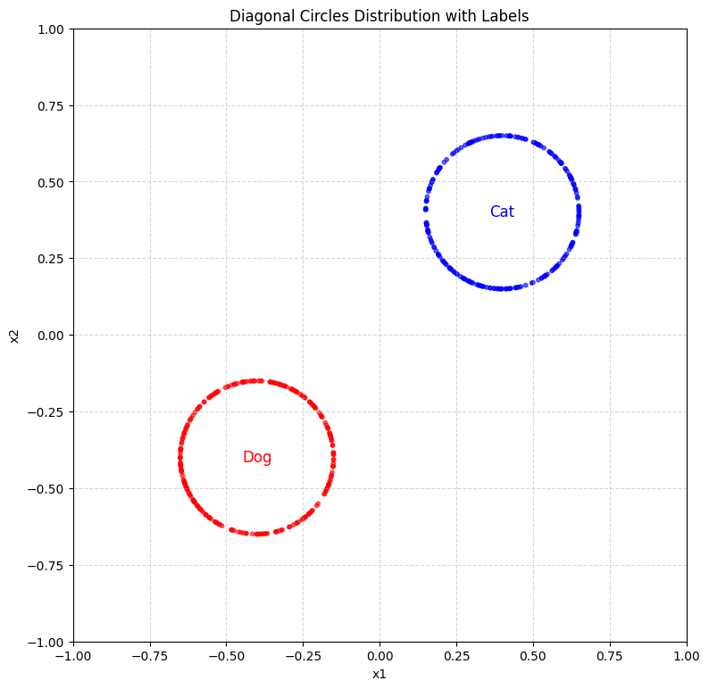
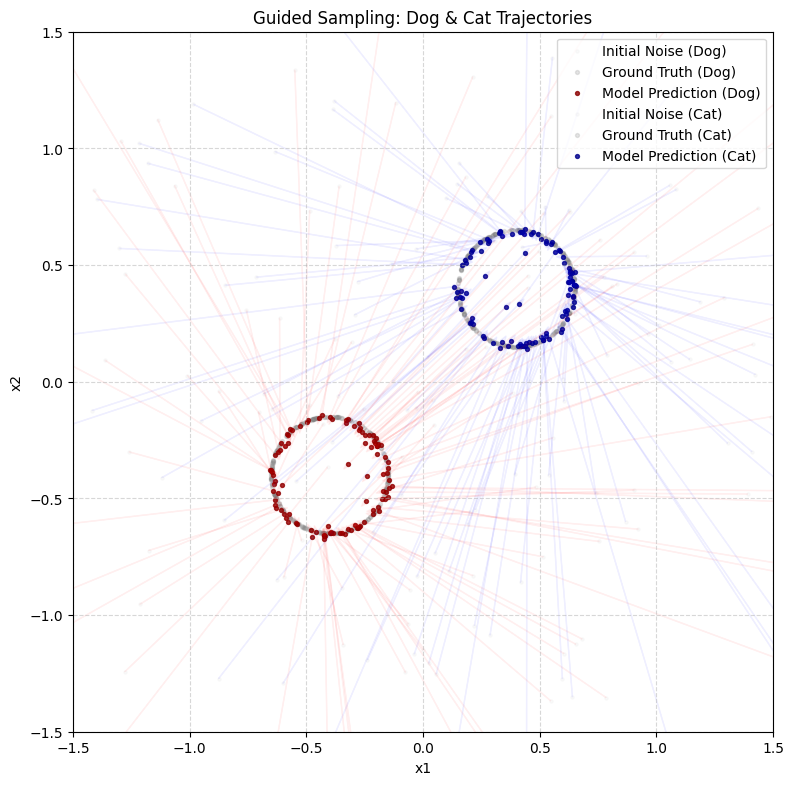
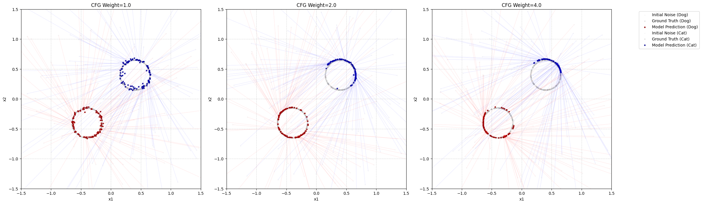



> This is a direct follow-up to [the earlier 2-D diffusion post](). The code below is trimmed to the essentials; the full, runnable version lives in the original notebook:
> [**github.com/litlig/notebooks/guided_2d_diffusion.ipynb**](https://github.com/litlig/notebooks/blob/main/guided_2d_diffusion.ipynb)
>
> <a href="https://colab.research.google.com/github/litlig/notebooks/blob/main/guided_2d_diffusion.ipynb" target="_parent"></a>

## Problem framing

In an unguided diffusion model, we sample a noise image and follow the diffusion process to arrive at an image. Often, though, we want to prompt the model to generate a *specific* kind of image; such generation is called **guided generation**.

We continue with the 2-dimensional example — a two-pixel image. We say the cluster in the upper right are cat images, and the cluster in the lower left are dog images.



## Vanilla guidance

With a text label/prompt \(y\), we want to learn a guided **vector field** that moves the probability mass toward the distribution of images conditioned on the label, \(p_{data}(\cdot\,|\,y)\).

Intuitively, we can follow the same procedure as unguided flow matching. For each training example, we sample a pair of image and label (or text caption). We train a neural network to estimate the conditional vector field, giving it the label \(y\) as an additional input. The loss function is still the mean squared error:

\[\min_{\theta}\ \mathbb{E}_{t \sim U(0,1),\ z,y \sim p_{data},\ x \sim p(\cdot\,|\,z)}\ \big\| f_t^\theta(x, y) - v_t(x\,|\,z) \big\|^2\]

When the target \(z\) is given, the conditional vector field is computed the same way as before:

\[v_t(x\,|\,z) = \dot{a}_t\, x_0 + \dot{b}_t\, z\]

The label enters the network through an embedding, which is concatenated with \(x_t\) and \(t\):

```python
class ConditionalFlowModel(nn.Module):
  def __init__(self, embedding_dim=2, num_classes=2):
    super().__init__()
    self.embedding = nn.Embedding(num_classes, embedding_dim)
    input_size = 2 + 1 + embedding_dim  # xt + t + label embedding
    self.net = nn.Sequential(
        nn.Linear(input_size, 128), nn.SiLU(),
        nn.Linear(128, 128), nn.SiLU(),
        nn.Linear(128, 128), nn.SiLU(),
        nn.Linear(128, 2),
    )

  def forward(self, xt, t, y):
    y_embedded = self.embedding(y.squeeze(-1))
    return self.net(torch.cat([xt, t, y_embedded], dim=-1))
```

Sampling then just fixes the guidance label and integrates the field with Euler steps. With `guide_label=0` we pull noise toward the dogs, with `guide_label=1` toward the cats:



## Classifier-free guidance

In this simple example, the vanilla approach above already works reasonably well. In practice, though, samples from such a model often don't follow the prompt or label very strongly. The guided probability path is \(p_t(x\,|\,y)\). By Bayes' theorem:

\[p_t(x\,|\,y) = \frac{p_t(y\,|\,x)\, p_t(x)}{p_t(y)}\]

Taking the log of both sides and then the gradient with respect to \(x\) (the \(p_t(y)\) term drops out, since it doesn't depend on \(x\)):

\[\nabla \log p_t(x\,|\,y) = \nabla \log p_t(y\,|\,x) + \nabla \log p_t(x)\]

\(\nabla \log\) is the **score function**. For a Gaussian probability path, the vector field relates to the score by \(v_t(x) = \alpha_t \nabla \log p_t(x) + \beta_t x_t\). Substituting gives a formula that connects the two vector fields:

\[v_t(x\,|\,y) = v_t(x) + \alpha_t \nabla \log p_t(y\,|\,x)\]

The extra term \(\nabla \log p_t(y\,|\,x)\) is what contributes the guidance. A natural way to make generation follow the guidance more strongly is to scale this term up. Estimating \(p_t(y\,|\,x)\) is essentially a classification problem — given a noisy sample \(x\), predict its label — so this approach is called **classifier guidance**: it requires training one network for the vector field and a separate classifier.

A more elegant approach eliminates the need for a separate classifier. Given the guided vector field \(v_t(x\,|\,y)\) and the unguided vector field \(v_t(x)\), the influence of guidance is \(v_t(x\,|\,y) - v_t(x)\). We scale it up by a weight \(w > 1\) and use the following in forward sampling:

\[(1-w)\, v_t(x) + w\, v_t(x\,|\,y)\]

To get both \(v_t(x)\) and \(v_t(x\,|\,y)\) from a single network, we treat the unguided vector field as a guided one with a special *null* prompt, which we inject at random into a fraction of the training samples:

```python
def get_batch(dist_fn, batch_size, inject_rate=0.1):
  z, y = dist_fn(batch_size)
  z = torch.from_numpy(z).float()
  y = torch.from_numpy(y).long().unsqueeze(1)
  x0 = torch.randn(batch_size, 2)
  t = torch.rand(batch_size, 1)
  xt = (1 - t) * x0 + t * z
  vf = z - x0

  # Randomly replace some labels with the special 'null' label (2)
  num_inject = int(batch_size * inject_rate)
  if num_inject > 0:
    inject_indices = torch.randperm(batch_size)[:num_inject]
    y[inject_indices] = 2
  return xt, t, y, vf
```

At sampling time we run the network twice per step — once with the real label, once with the null label — and combine them with the guidance weight:

```python
def cfg_sample(model, nsample, steps=100, guide_label=0, weight=2.0):
  null_label = 2
  x = torch.randn(nsample, 2)
  dt = 1.0 / steps
  y_guide = torch.full((nsample, 1), guide_label, dtype=torch.long)
  y_null  = torch.full((nsample, 1), null_label,  dtype=torch.long)
  for step in range(steps):
    t = (step / steps) * torch.ones(nsample, 1)
    vf_guided   = model(x, t, y_guide)
    vf_unguided = model(x, t, y_null)
    x = x + ((1 - weight) * vf_unguided + weight * vf_guided) * dt
  return x
```

Sweeping the guidance weight shows its effect directly. At \(w=1\) we recover plain conditional sampling. As \(w\) grows, the guidance term is amplified: samples cling more tightly to their target cluster and drift further from the opposite one — the samples follow the prompt more faithfully, at the cost of some diversity as they concentrate.


