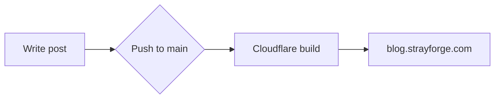

This first post exists to verify the blog renders **math**, **code**, **diagrams**,
and **charts**. Delete it once you've confirmed everything looks right.

## Math (KaTeX)

Inline math like $e^{i\pi} + 1 = 0$ renders mid-sentence. Block math:

$$
\hat{\beta} = (X^\top X)^{-1} X^\top y
$$

## Code

Syntax highlighting with a copy button (hover the block):

```python
def fib(n: int) -> int:
    a, b = 0, 1
    for _ in range(n):
        a, b = b, a + b
    return a

print([fib(i) for i in range(10)])
```

## Diagram (Mermaid)



## Chart (Chart.js)


type: 'line',
data: {
  labels: ['Jan', 'Feb', 'Mar', 'Apr', 'May'],
  datasets: [{
    label: 'Commits',
    data: [12, 19, 7, 22, 30],
    borderColor: '#3b82f6',
    tension: 0.3
  }]
}


That's the full toolkit — write away.
