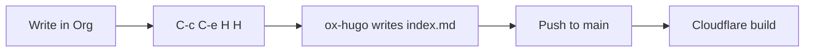

This post is authored in `org/blog.org` and exported to
`content/posts/my-first-org-post/index.md` by ox-hugo. Flip
`:EXPORT_HUGO_DRAFT:` to `false` when it's ready to publish.


## Math (KaTeX) {#math--katex}

I just want to add something here.
The `:math true` custom front matter above turns on KaTeX for this page.
Inline math like \\(e^{i\pi} + 1 = 0\\) renders mid-sentence. Block math:

\begin{equation}
\hat{\beta} = (X^\top X)^{-1} X^\top y
\end{equation}


## Code {#code}

Org source blocks become fenced, syntax-highlighted code blocks:

```python
def fib(n: int) -> int:
    a, b = 0, 1
    for _ in range(n):
        a, b = b, a + b
    return a

print([fib(i) for i in range(10)])
```


## Diagram (Mermaid) {#diagram--mermaid}

Use a `mermaid` source block; Hugo/Blowfish renders it client-side:




## Chart (Blowfish shortcode) {#chart--blowfish-shortcode}

Hugo shortcodes must be passed through verbatim, so wrap them in an
`md` export block — ox-hugo emits the contents as-is:


type: 'line',
data: {
  labels: ['Jan', 'Feb', 'Mar', 'Apr', 'May'],
  datasets: [{
    label: 'Commits',
    data: [12, 19, 7, 22, 30],
    borderColor: '#3b82f6',
    tension: 0.3
  }]
}


That's the full toolkit — duplicate this heading to start a new post.
